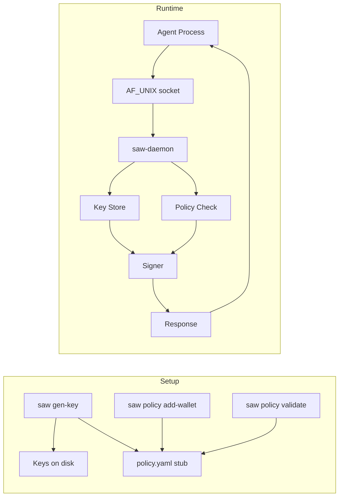

# Secure Agent Wallet (SAW)

Local signing service for AI agents. Keys never leave the daemon, policy gates every signing request, and all access is via a Unix domain socket.

**Status**
- Key generation for EVM + Solana (no import)
- Policy file with strict schema and CLI helpers
- Daemon with `get_address`, `sign_evm_tx`, `sign_eip2612_permit`, `sign_sol_tx`
- Socket and key permissions enforced
- Limitation: Solana signing currently operates on raw message bytes and cannot enforce recipient allowlists, value limits, or chain IDs. Tracking full Solana transaction parsing and policy enforcement in [issue #2](https://github.com/daydreamsai/agent-wallet/issues/2).

**Components**
- `saw` CLI: keygen and policy management
- `saw-daemon`: AF_UNIX server that signs on behalf of wallets
- `policy.yaml`: signing rules per wallet
- `/opt/saw/keys`: raw binary keys on disk

**Flowchart**


**Installation**

Download the latest release:
```bash
# Download and extract the release (replace VERSION and ARCH)
curl -LO https://github.com/daydreamsai/agent-wallet/releases/download/vVERSION/saw-VERSION-linux-x86_64.tar.gz
tar xzf saw-VERSION-linux-x86_64.tar.gz
sudo cp saw saw-daemon /usr/local/bin/
```

Or build from source:
```bash
cargo build --release
sudo cp target/release/saw target/release/saw-daemon /usr/local/bin/
```

**Quick Start**
1. Install layout
```bash
sudo saw install --root /opt/saw
```

2. Generate a wallet
```bash
sudo saw gen-key --chain evm --wallet main --root /opt/saw
```
Save the printed address and public key — there is no command to retrieve them later without the daemon running.

3. Edit `policy.yaml` to add constraints (the default stub has **no limits**):
```bash
sudo nano /opt/saw/policy.yaml
```
See [Policy Schema](#policy-schema-strict) below for available fields.

4. Validate policy
```bash
saw policy validate --root /opt/saw
```

5. Start daemon
```bash
saw-daemon --socket /run/saw/saw.sock --root /opt/saw
```

**Systemd Setup (recommended for production)**

Create the required user and group:
```bash
sudo useradd --system --no-create-home --shell /usr/sbin/nologin saw
sudo groupadd --system saw-agent
sudo usermod -aG saw-agent saw
```

Set ownership on the data directory:
```bash
sudo chown -R saw:saw /opt/saw
sudo chgrp -R saw-agent /opt/saw/keys
```

Install and enable the service:
```bash
sudo cp systemd/saw.service /etc/systemd/system/
sudo systemctl daemon-reload
sudo systemctl enable --now saw
```

Verify it's running:
```bash
sudo systemctl status saw
```

The daemon will listen on `/run/saw/saw.sock`. Add your agent's service user to the `saw-agent` group so it can connect to the socket:
```bash
sudo usermod -aG saw-agent <agent-user>
```

**Node.js Client**

The [`@daydreamsai/saw`](packages/saw/) npm package provides a typed client:
```bash
npm install @daydreamsai/saw
```
```typescript
import { createSawClient } from "@daydreamsai/saw";

const saw = createSawClient();
const address = await saw.getAddress();
```
See [packages/saw/README.md](packages/saw/README.md) for full API docs.

**CLI Commands**
- `saw install [--root <path>]`
- `saw gen-key --chain <evm|sol> --wallet <name> [--root <path>]`
- `saw address --chain <evm|sol> --wallet <name> [--root <path>]`
- `saw list [--root <path>]`
- `saw policy validate [--root <path>]`
- `saw policy add-wallet --wallet <name> --chain <evm|sol> [--root <path>]`
- `saw-daemon [--socket <path>] [--root <path>]`

All commands support `--help` for usage details.

**Policy Schema (strict)** <a id="policy-schema-strict"></a>
```yaml
wallets:
  main:
    chain: evm
    allowed_chains: [1, 8453]
    max_tx_value_eth: 0.05
    allow_contract_calls: false
    allowlist_addresses:
      - "0xabc..."
    rate_limit_per_minute: 5
```
Unknown fields are rejected.

**Request/Response Examples**
All messages are JSON on a Unix socket. The daemon reads a single request and replies with a single response.

Get address:
```json
{"request_id":"1","action":"get_address","wallet":"main"}
```

Sign EVM tx (EIP-1559):
```json
{
  "request_id":"2",
  "action":"sign_evm_tx",
  "wallet":"main",
  "payload": {
    "chain_id": 1,
    "nonce": 0,
    "to": "0x1111111111111111111111111111111111111111",
    "value": "0x0",
    "gas_limit": 21000,
    "max_fee_per_gas": "0x3b9aca00",
    "max_priority_fee_per_gas": "0x3b9aca00",
    "data": "0x"
  }
}
```
Response:
```json
{
  "request_id":"2",
  "status":"approved",
  "result": {
    "raw_tx":"0x...",
    "tx_hash":"0x..."
  }
}
```

Sign EIP-2612 permit (EIP-712 typed data):
```json
{
  "request_id":"3",
  "action":"sign_eip2612_permit",
  "wallet":"main",
  "payload": {
    "chain_id": 1,
    "token": "0x1111111111111111111111111111111111111111",
    "name": "USD Coin",
    "version": "2",
    "spender": "0x2222222222222222222222222222222222222222",
    "value": "1000000",
    "nonce": "0",
    "deadline": "9999999999",
    "owner": "0xaaaaaaaaaaaaaaaaaaaaaaaaaaaaaaaaaaaaaaaa"
  }
}
```
Response:
```json
{
  "request_id":"3",
  "status":"approved",
  "result": {
    "signature":"0x..."
  }
}
```
Notes:
- If `allowlist_addresses` is set, both `token` and `spender` must be in the allowlist.
- If `owner` is provided, it must match the wallet address.

Sign Solana tx (message bytes):
**Warning:** The daemon signs raw message bytes only (not full Solana transaction structures). Because of this, it cannot enforce policy checks like recipient allowlists, value limits, or chain IDs for Solana yet.

**Recommended mitigation (until full parsing):**
- Only send pre-validated messages from a trusted component.
- Use a dedicated Solana wallet with low balances and restrictive operational controls.

```json
{
  "request_id":"4",
  "action":"sign_sol_tx",
  "wallet":"treasury",
  "payload": {
    "message_base64":"aGVsbG8tc29sYW5h"
  }
}
```
Response:
```json
{
  "request_id":"4",
  "status":"approved",
  "result": {
    "signature":"...",
    "signed_tx_base64":"..."
  }
}
```
`signed_tx_base64` is a minimal encoding: `1 || signature || message` (signature count + signature + message bytes).

**Permissions**
- `keys/` and `keys/<chain>/` are set to `0700`
- key files are set to `0600`
- socket is set to `0660` to allow group read/write so multiple authorized processes can connect. Access is controlled solely by Unix permissions; the daemon does not perform additional authentication or authorization beyond the socket file owner/group/mode.
- **Operator guidance:** restrict the socket’s group to a dedicated minimal-permission group (create a dedicated group, `chgrp` the socket and key dirs, and avoid adding users to broad groups).
- **Hardening options:** use filesystem ACLs (`setfacl`), enforce `chown`/`chgrp` on startup, or apply MAC controls (SELinux/AppArmor) to limit which processes can access the socket and key paths.
- **Example workflow (single service access):** create group `saw-agent`, add only the service user to that group, `chgrp -R saw-agent /opt/saw`, ensure `audit.log` exists and is monitored, then connect to the daemon via the socket and review `audit.log` for access visibility.
- `audit.log` is created with `0640`

**Audit Logging**
Each request appends a single line to `audit.log` with:
- timestamp
- wallet
- action
- status (approved/denied)
- tx hash (when applicable)

**Notes**
- Rate limits are in-memory per daemon process.
- Requests larger than 64 KiB are rejected.
- Daemon exits cleanly on `SIGINT` or `SIGTERM`.
