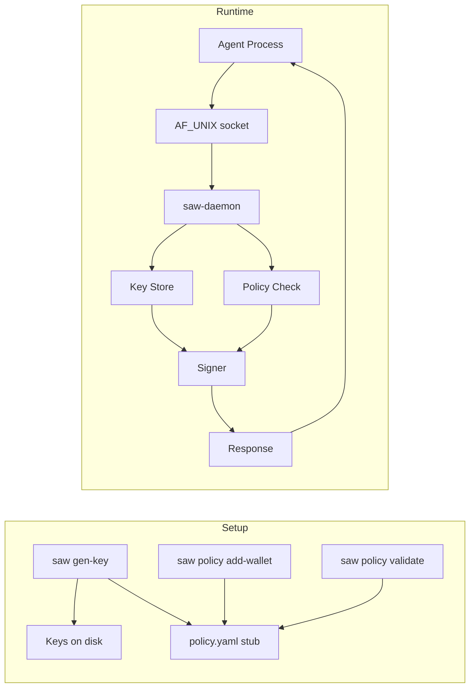

# Secure Agent Wallet (SAW)

Local signing service for AI agents. Keys never leave the daemon, policy gates every signing request, and all access is via a Unix domain socket.

**Status**
- Key generation for EVM + Solana (no import)
- Policy file with strict schema and CLI helpers
- Daemon with `get_address`, `sign_evm_tx`, `sign_sol_tx`
- Socket and key permissions enforced

**Components**
- `saw` CLI: keygen and policy management
- `saw-daemon`: AF_UNIX server that signs on behalf of wallets
- `policy.yaml`: signing rules per wallet
- `/opt/saw/keys`: raw binary keys on disk

**Flowchart**


**Quick Start**
1. Install layout
```bash
saw install --root /opt/saw
```

1. Generate a wallet
```bash
saw gen-key --chain evm --wallet main --root /opt/saw
```

2. Validate policy
```bash
saw policy validate --root /opt/saw
```

3. Start daemon
```bash
saw-daemon --socket /run/saw.sock --root /opt/saw
```

**CLI Commands**
- `saw install --root <path>`
- `saw gen-key --chain <evm|sol> --wallet <name> --root <path>`
- `saw policy validate --root <path>`
- `saw policy add-wallet --wallet <name> --chain <evm|sol> --root <path>`
- `saw-daemon --socket <path> --root <path>`

**Policy Schema (strict)**
```yaml
wallets:
  main:
    chain: evm
    allowed_chains: [1, 8453]
    max_tx_value_eth: 0.05
    allow_contract_calls: false
    allowlist_addresses:
      - "0xabc..."
    rate_limit_per_minute: 5
```
Unknown fields are rejected.

**Request/Response Examples**
All messages are JSON on a Unix socket. The daemon reads a single request and replies with a single response.

Get address:
```json
{"request_id":"1","action":"get_address","wallet":"main"}
```

Sign EVM tx (EIP-1559):
```json
{
  "request_id":"2",
  "action":"sign_evm_tx",
  "wallet":"main",
  "payload": {
    "chain_id": 1,
    "nonce": 0,
    "to": "0x1111111111111111111111111111111111111111",
    "value": "0x0",
    "gas_limit": 21000,
    "max_fee_per_gas": "0x3b9aca00",
    "max_priority_fee_per_gas": "0x3b9aca00",
    "data": "0x"
  }
}
```
Response:
```json
{
  "request_id":"2",
  "status":"approved",
  "result": {
    "raw_tx":"0x...",
    "tx_hash":"0x..."
  }
}
```

Sign Solana tx (message bytes):
```json
{
  "request_id":"3",
  "action":"sign_sol_tx",
  "wallet":"treasury",
  "payload": {
    "message_base64":"aGVsbG8tc29sYW5h"
  }
}
```
Response:
```json
{
  "request_id":"3",
  "status":"approved",
  "result": {
    "signature":"...",
    "signed_tx_base64":"..."
  }
}
```
`signed_tx_base64` is a minimal encoding: `1 || signature || message` (signature count + signature + message bytes).

**Permissions**
- `keys/` and `keys/<chain>/` are set to `0700`
- key files are set to `0600`
- socket is set to `0660`
- `audit.log` is created with `0640`

**Audit Logging**
Each request appends a single line to `audit.log` with:
- timestamp
- wallet
- action
- status (approved/denied)
- tx hash (when applicable)

**Notes**
- Rate limits are in-memory per daemon process.
- Solana signing currently signs raw message bytes, not full transaction structures.
- Requests larger than 64 KiB are rejected.
- Daemon exits cleanly on `SIGINT` or `SIGTERM`.
