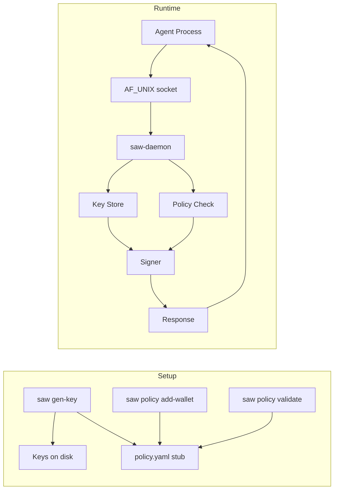

# Contributing

## Build & Test

```bash
# Build all Rust crates
cargo build --workspace

# Run all tests
cargo test --workspace

# Run a single test by name
cargo test --workspace -- test_name

# Run tests for a specific crate
cargo test -p saw          # CLI crate
cargo test -p saw-daemon   # daemon crate

# Build the Node.js client
cd packages/saw && npm install && npm run build

# Run Node.js client tests (requires vitest)
cd packages/saw && npm test

# Docker
./setup.sh                 # build, onboard (first run), start
docker compose logs -f     # watch startup
```

## Architecture



### Crate Structure

**Rust workspace** with two crates:

- **`crates/saw-cli`** (`saw` binary) — Key generation (EVM via k256/secp256k1, Solana via ed25519-dalek), policy management (YAML with `serde_yaml`, `deny_unknown_fields`), directory layout setup.

- **`crates/saw-daemon`** (`saw-daemon` binary) — AF_UNIX server that accepts JSON requests, enforces policy checks, signs transactions, and writes to `audit.log`. Uses blocking I/O with non-blocking listener accept loop and `set_read_timeout`. No async runtime.

- **`packages/saw`** (`@daydreamsai/saw` npm package) — TypeScript client over Unix socket. Built with tsup, tested with vitest.

### Data Layout

Default root: `~/.saw/`

```
keys/
  evm/<wallet>.key     # raw binary private key (0600)
  sol/<wallet>.key
policy.yaml            # per-wallet signing rules (strict schema)
audit.log              # append-only request log
saw.sock               # Unix domain socket (0660)
```

### Key Patterns

- Both crates duplicate `Chain`, `WalletPolicy`, `Policy` types (no shared crate). The daemon re-reads `policy.yaml` on every request.
- Wallet names: alphanumeric, `_`, `-`, 1-64 chars.
- EVM signing uses `secp256k1` for recoverable ECDSA. EIP-1559 (type 2) transactions only.
- Solana signing operates on raw message bytes — no transaction parsing.
- Tests create isolated temp directories and use the library API directly (not shelling out).

## CI

GitHub Actions runs `cargo test --workspace` on Ubuntu and macOS. See `.github/workflows/ci.yml`.

## Releases

Releases are published via `.github/workflows/release.yml`:
- Builds binaries for macOS and Linux
- Publishes to GitHub Releases with checksums
- Publishes the npm package to the registry
- Requires semantic versioning tags
